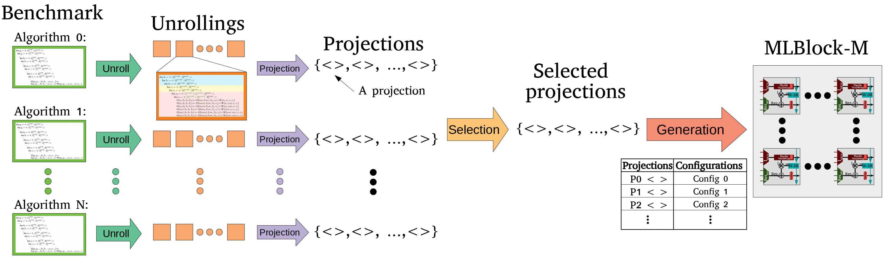

# MLBlocks - Rethinking Embedded Blocks for Machine Learning Applications



This repository is related to MLBlocks architecture published at [The International Conference on Field-Programmable Technology (FPT’21), Auckland, New Zealand](https://parallel.auckland.ac.nz/fpt21/). We sincerely appriciate your patience, as we are still working on the tutorial and documents. 

You can find the main paper [here](https://dx.doi.org/10.1145/3491234):


    @inproceedings{FPT21MLBlock,
      author    = {SeyedRamin Rasoulinezhad and
                   Esther Roorda and
                   Steve Wilton and
                   Philip H. W. Leong and
                   David Boland},
      title     = {Rethinking Embedded Blocks for Machine Learning Applications},
      booktitle = {TRETS FPT Journal Track, The International Conference on Field-Programmable Technology ({FPT21}), Auckland, New Zealand, December 6 - 10, 2021},
      year      = {2021},
      url       = {https://dx.doi.org/10.1145/3491234},
      doi       = {10.1145/3491234},
    }


# Directories:


```
MLBlocks 
├───Alg2Block
│   └─── Python-based block generator - Outputs: Tables 2, 3, and 5; Figures 11, 12, and 13.
├───verilog
│   └─── MLBlock parameterized architectural Verilog models
├───ml_benchmark_gen
│   └─── Python-based full implementation code generator - Outputs: Figures 14, 15, 16, and 17.
├───PIRDSP_verilogs
│   └─── PIR-DSP parameterized Verilog models
├───out
│   └─── output reports/models by Alg2Block scripts 
├───TRETS/Figures
│   └───Selected pictures from the manuscript
├───tests
│   └───FPGA tests (Vivado project scripts) - Output: Table 4 in the manuscript. 
├───asic
│   └───ASIC tests (RTL Encounter scripts) - 
├───.gitignore
└───README.md
```

# re-generate the results of the paper

In the paper, we have two types of experiments. 

    1. MLBlock generation flow which is implemented using a python-based tool, called Alg2Block. 
    2. Full implementation level exploration, using ml_benchmark_gen, a tool presented [here](). 

To reproduce the reported results, please follow the provided README.md files in the `Alg2Block` and `ml_benchmark_gen` directories, respectively. 
