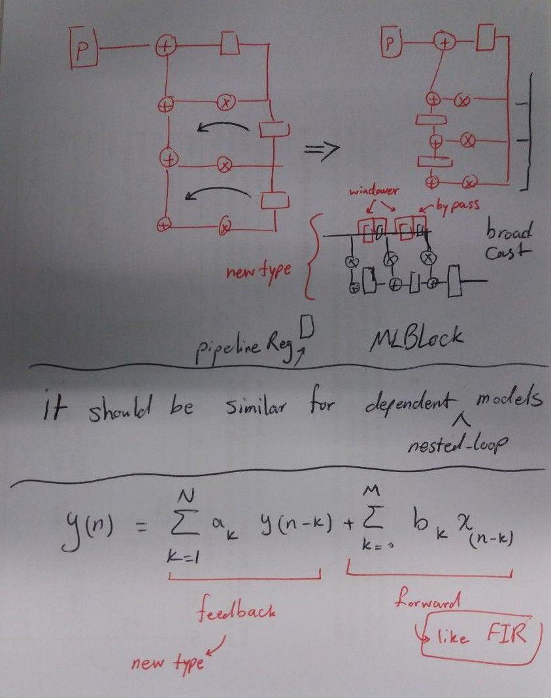

# Selected benchmarks:

We have three set of benchmarks plus an extra total set:

1- CNNs: 

    + EfficientNet layers 
    + baidu benchmarks

2- RNNs: 

    + baidu benchmark - lstm/GRU kernels (DeepBenchmark)
    + HALP - LSTM
    + Hebrue - LSTM
    + Microsoft model - LSTM

3- DSP:  FIR, IIR, (excluding FFT) - source: ?
    
    + (maybe) ADASMark (some layers)
    

# Founded benchmarks:

## General benchmarks (GEMMs, CNNs, RNNs): 

### DeepBench(great, by Baidu): 

    (https://github.com/baidu-research/DeepBench)

### MLPerf (No good): 
    
CNNs:    
    
    Resnet50-v1.5
    MobileNets-v1
    SSD-ResNet34
    SSD-MobileNets-v1

LSTM/RNNs:

    https://mlperf.org/inference-overview/#overview
    GNMT Model (big and complex): https://arxiv.org/pdf/1609.08144.pdf
    code: https://github.com/mlperf/inference/blob/master/v0.5/translation/gnmt/tensorflow/nmt/gnmt_model.py

&nbsp;
&nbsp;
&nbsp;
&nbsp;

## DSP benchmarks: 
    
### ADASMark Benchmark (good but we wait for licence):

A full object detection system (complex but perfect, we are waiting for the university permission)

    https://www.eembc.org/adasmark/

### UTDSP (1997 - FIR,LMS,FIR):
    
    1997_UTDSP.tar.gz, https://www.eecg.utoronto.ca/~corinna/

**FIR**
like 1D-Convolution (256 and 32 tap FIR)

**IIR:**
source: 

    https://www.diva-portal.org/smash/get/diva2:18815/FULLTEXT01.pdf
    https://www.researchgate.net/publication/341275963_Parallel_and_Pipeline_Implementations_of_IIR_Low_Pass_Filter_on_FPGA?enrichId=rgreq-fdbc3887c65bffaaf9d6cfee17e49d69-XXX&enrichSource=Y292ZXJQYWdlOzM0MTI3NTk2MztBUzo4ODk0NzQ0Njg4MjMwNDFAMTU4OTA3ODY0Nzc3NQ%3D%3D&el=1_x_3&_esc=publicationCoverPdf

It can be modeled by two types and each has its transfered model (by register moving and retiming, page 52). the forward path is a FIR filter and backward path is 

mathematics of an IIR:  

The forward path () is just like an FIR filter, So, it is fine for MLBlobk architecture. For, backward path () since there is a dependancy between the result and the next iteration, the loop can not be pipelined. so, we need register retiming, called transformed version. then, to implement that part, we need a new type of interconnection where there is a register between the MACs and there is broadcasting of input between the MACs. Thus the changes would be 1) window registers should by passed 2) pipeline register in the path of results should work as normal (without by pass). 

We don't support IIRs now, but to support them, we need configurations where the windowing registers can be by passsed and then everything should be fine. 

### Berkeley multimedia (2001):

    https://people.eecs.berkeley.edu/~slingn/
    2001_atom_tools.tar.gz
    2001_mm_accel_suite.tar.gz
    2001_mm_benchmark_suite.tar.gz

### RAW Benchmark Suite (1997):

    1997_benchmark_v1.0.tar.gz, http://groups.csail.mit.edu/cag/raw/benchmark/README.html

&nbsp;
&nbsp;
&nbsp;
&nbsp;

## RNN (LSTM/GRU) benchmarks:

This paper helped me to fine the sources: 

    https://arxiv.org/pdf/1806.01818.pdf

Understanding of LSTM/GRU costs:

    https://pytorch.org/docs/stable/generated/torch.nn.LSTM.html
    https://pytorch.org/tutorials/beginner/nlp/sequence_models_tutorial.html
    https://towardsdatascience.com/gate-recurrent-units-explained-using-matrices-part-1-3c781469fc18

**LSTM Computation** (concatanations: "|" horizental and "/" vertical)**:**

    [i/f/c/o] = ([[wiin/wfin/wcin/woin] | [wih/wfh/wch/woh]) * ([in/ht-1]) + [b/b/b/b]

The cost (without batch):

    [] = [[4h x in],[4h x h]]  x  [(in / h) x 1]
    [] = [4h x (in | h)]       x  [(in / h) x 1]

The cost with batch (baidu DeepBench assumes:  in = h):

    [] = [4h x (in | h)]       x  [(in / h) x B]

**GRU computation:**

    [i/f/c/o] = ([[wzin/wrin/whin] | [wzh/wrh/whh]) * ([in/ht-1]) + [b/b/b]

The cost with batch (baidu DeepBench assumes:  in = h):

    [] = [3h x (in | h)]       x  [(in / h) x B]

### HALP (good):

26 char, 2LSTM (128node) FC26, 8bit

    https://www.cs.cornell.edu/~cdesa/papers/arxiv2018_lpsvrg.pdf
    https://arxiv.org/pdf/1803.03383.pdf

### Hebrue et al. (good):

RNN 1 hidden 2048, 3-4 bit
LSTM 1 hidden 300, 3-4 bit 

    https://catalog.ldc.upenn.edu/docs/LDC95T7/cl93.html
    https://www.jmlr.org/papers/volume18/16-456/16-456.pdf

### A google model (complex):

A quantized (8bit) 4 layers mixed of RNN and LSTM:

    https://static.googleusercontent.com/media/research.google.com/en//pubs/archive/45379.pdf

### Alibaba (ok)

A quantized sound detector:

    ALTERNATINGMULTI-BITQUANTIZATION FORRECURRENTNEURALNETWORKS (https://arxiv.org/pdf/1802.00150.pdf)
    
### Microsoft LSTM network (easy):

Two separate LSTM50-->64 and LSTM100-->64 followed by a FC128-->64 

    A Sentiment-and-Semantics-Based Approach for EmotionDetection in Textual Conversations (https://www.researchgate.net/publication/318671090_A_Sentiment-and-Semantics-Based_Approach_for_Emotion_Detection_in_Textual_Conversations?enrichId=rgreq-76d09f0b0a6b99e51e03b476603f55cc-XXX&enrichSource=Y292ZXJQYWdlOzMxODY3MTA5MDtBUzo1NjA2MTkyOTc4ODIxMTJAMTUxMDY3MzQ2NDU5NA%3D%3D&el=1_x_3&_esc=publicationCoverPdf)

